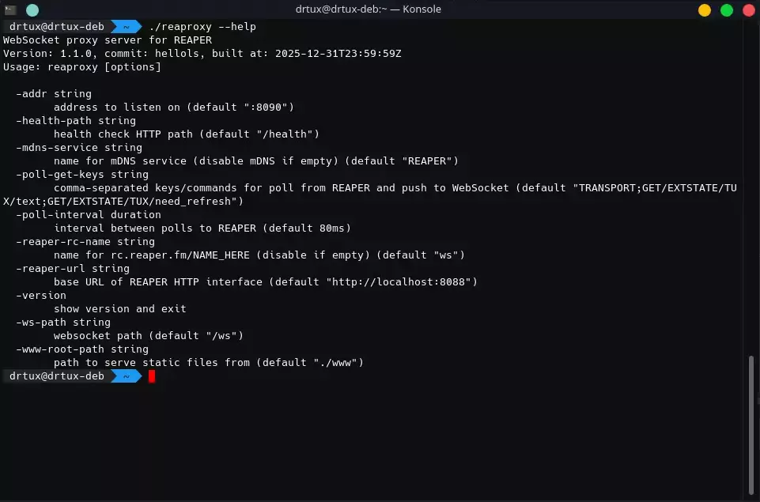
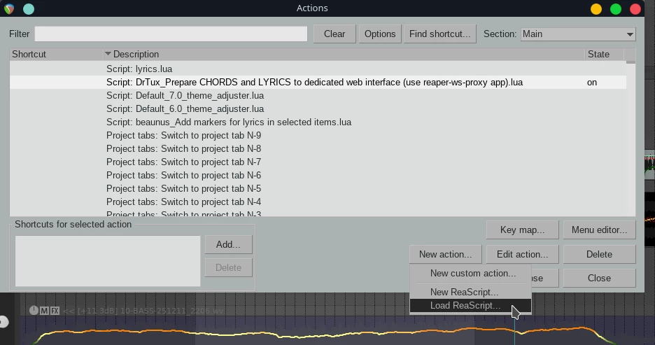
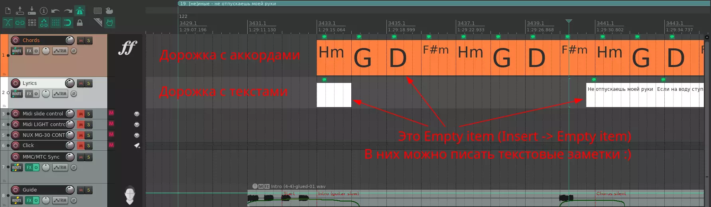
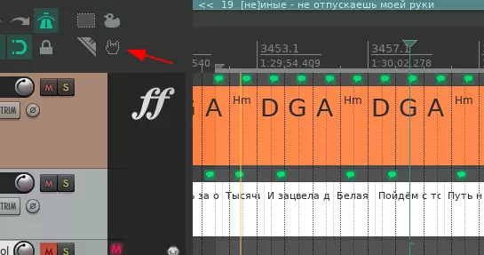
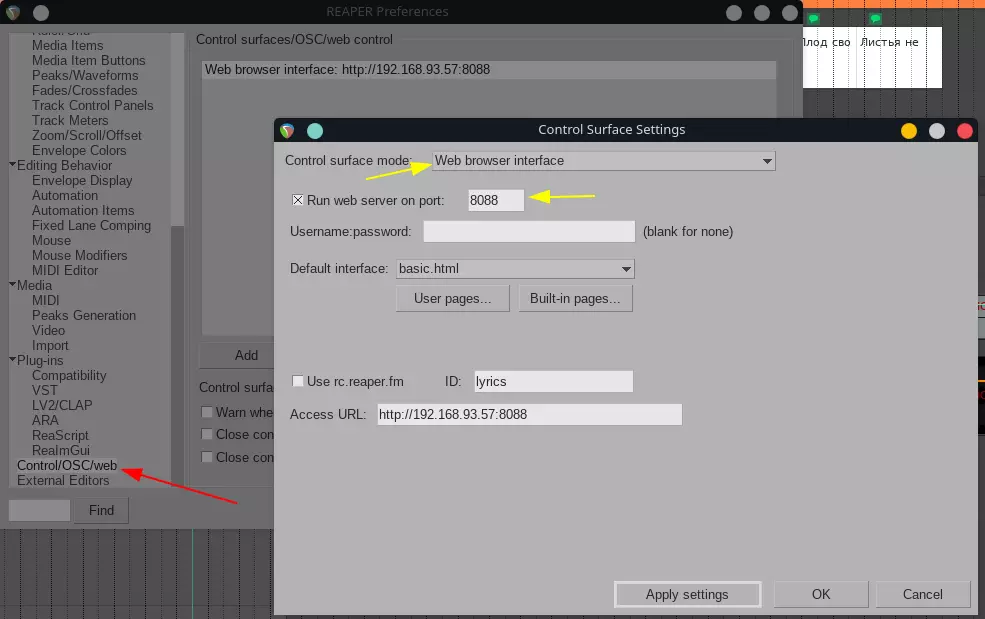
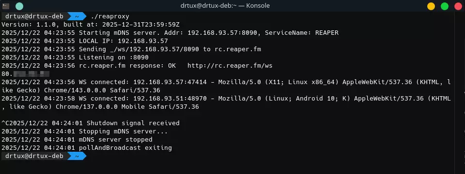
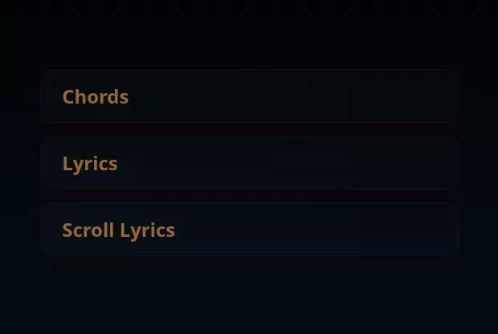

# Reaper-WS-Proxy
Прокси-сервер для REAPER с поддержкой веб-сокетов для показа аккордов и текстов.

[](https://github.com/karamush/reaper-ws-proxy/releases/latest) [](https://github.com/karamush/reaper-ws-proxy/releases)

Оптимизирует нагрузку на веб-интерфейс REAPER: раздаёт всем подключенным клиентам текущее состояние транспорта (позиция курсора воспроизведения, playback state) и любые другие запрашиваемые ключи. Остальные запросы проксирует напрямую в REAPER.
Без этой программы уже при двух или трёх клиентах связь начинает теряться - встроенный веб-сервер рипера не выдерживает такого частого обновления данных (ddos атака 😁). Теперь к риперу обращается только один клиент с определённым интервалом, ничего не перегружая, а остальным клиентам раздаёт по веб-сокетам без необходимости клиентам постоянно опрашивать сервер для получения актуального состояния. 

Включает также плагин для рипера (на Lua) для подготовки аккордов и текстов для веб-интерфейса, красивое меню и сами странички для показа аккордов и текста.
Странички можно кастомизировать и допиливать под свои нужды 😎

Поддерживает `rc.reaper.fm` (для подключения по имени, а не по IP) и `mDNS` (в _http._tcp) для обнаружения в локальной сети.

### Вывод команды `-help`:
```
WebSocket proxy server for REAPER
Version: 1.1.0, commit: hellols, built at: 2025-12-31T23:59:59Z
Usage: reaproxy [options]

-addr string
      address to listen on (default ":8090")
-health-path string
      health check HTTP path (default "/health")
-mdns-service string
      name for mDNS service (disable mDNS if empty) (default "REAPER")
-poll-get-keys string
      comma-separated keys/commands for poll from REAPER and push to WebSocket (default "TRANSPORT;GET/EXTSTATE/TUX/text;GET/EXTSTATE/TUX/need_refresh")
-poll-interval duration
      interval between polls to REAPER (default 80ms)
-reaper-rc-name string
      name for rc.reaper.fm/NAME_HERE (disable if empty) (default "ws")
-reaper-url string
      base URL of REAPER HTTP interface (default "http://localhost:8088")
-version
      show version and exit
-ws-path string
      websocket path (default "/ws")
-www-root-path string
      path to serve static files from (default "./www")
```

[](./.github/readme_assets/help.webp)

### Кратко по *некоторым* ключам-параметрам:

- `-addr` - адрес и порт, которые будет слушать программа
- `-poll-get-keys` - ключи или команды через точку с запятой, запрашиваемые у REAPER и отсылаемые всем клиентам. По-умолчанию содержит всё нужное для работы аккордов и текстов
- `-poll-interval` - интервал запросов к REAPER за обновлениями
- `-reaper-rc-name` - имя для `rc.reaper.fm` (перейдя по адресу rc.reaper.fm/ИМЯ) можно попасть в интерфейс программы, не вводя вручную IP адрес
- `-reaper-url` - адрес подключения к REAPER-овскому веб-интерфейсу (сначала надо его настроить, об этом ниже). Можно указать адрес рипера, запущенного на другом компьютере, а не только локально
- `-mdns-service` - имя сервиса для mDNS (zeroconf, Apple Bonjour) для публикации его в локальной сети и нахождения другими программами (по-умолчанию `REAPER` в пространстве `_http._tcp`) 

Остальные параметры лучше не трогать и не менять без необходимости, может повлиять на работоспособность :)

## Установка
1. **Скачать архив** [последнего релиза](https://github.com/karamush/reaper-ws-proxy/releases/latest) для нужной операционной системы и архитектуры
2. **Распаковать** *куда-нибудь* все файлы (желательно сохранить структуру, особенно важна папка `www`)
3. **Добавить в REAPER lua-скрипт**, необходимый для подготовки аккордов и текстов:
- открыть Action-list
- нажать `New Action -> Load ReaScript` и выбрать lua-файл из папки `REAPER-SCRIPTS/`
[](./.github/readme_assets/reaper-load-script.webp)
- скрипт добавлен! ✅ Пока что вручную, но позже будет через ReaPack :)
- теперь на этот скрипт можно назначить горячую клавишу или создать кастомную кнопочку на одной из панелей. Скрипт работает в режиме Toggle, так что он при первом вызове запустится, а при втором завершится. Когда он включен, привязанная к нему кнопка запуска будет в нажатом состоянии, а в списке Actions будет State=On

## Подготовка REAPER и запуск скрипта
1. Для работы всей системы нужно добавить дорожку аккордов `Chords` и дорожку для текстов `Lyrics` (не обязательно добавлять именно обе, можно только ту, что нужна, но скрипт при запуске предупредит на всякий случай)
2. На дорожки необходимо добавить так называемые `Empty item` (`Insert -> Empty item`) или `Alt+E`. В этих элементах пишутся текстовые заметки, которые в данном случае будут аккордами или текстами песен
3. Аккорды по времени желательно располагать прям там, где они должны прозвучать, и растянуть на таймлайне также до необходимого времени
4. А вот тексты лучше чуть заранее, но это зависит от потребностей. Но обычно лучше чуть заранее, чтоб поющие могли увидеть текст до того, как его нужно пропеть :)
[](./.github/readme_assets/chords-and-lyrics-tracks-items.webp)
5. После добавления/обновления аккордов и/или текста нужно вызвать скрипт (горячей клавишей, кнопкой на тулбаре или вручную через Action list)
6. И всё же удобней делать это кнопкой на тулбаре. Кнопке можно задать любую картинку или название. Она показывает статус активности (картинка кликабельна):
[](./.github/readme_assets/toolbar-btn-toggle.mp4)
7. Нужно добавить веб-интерфейс управления через `Options -> Preferences -> Control/OSC/Web`:
[](./.github/readme_assets/reaper-web-interface-control.webp)
Даже не важно какую страницу выбирать в Default interface, ведь программа переопределит свою, но вот Control surface mode нужно выбрать именно `Web browser interface`, и порт можно поставить `8088`, если он свободен, и тогда в программе не придётся менять порт в `-reaper-url`

## Запуск программы проксирования
Программа консольная, поэтому для Windows можно запустить как из консоли, так и двойным кликом (запустится с параметрами по-умолчанию, если их не переопределить).
Для *nix систем запуск аналогичен, но лучше через консоль (todo: можно обернуть в docker):
[](./.github/readme_assets/run-connect-stop.webp)

При запуске показывается версия и время сборки, также отображается статус запуска веб-сервера, mDNS сервиса и публикации адреса в `rc.reaper.fm`.
Подключающиеся и отключающиеся клиенты также показываются в логах (IP и User-Agent тоже). При остановке (sigint) все сервисы аккуратно завершаются и программа закрывается.

После успешного запуска можно зайти по IP адресу и порту, который слушает программа, чтоб увидеть красивую менюшку (кликабельно):
[](./.github/readme_assets/demo.mp4)

---
### Послесловие

Изначально разрабатывалось для нашего [декабрьского рождественского концерта](https://vk.com/dec27event), чтоб музыкантам подсматривать аккорды, вокалистам подсматривать тексты, а также чтоб в зал транслировать текущую строку, но даже до концерта пригождалось как для разучивания песен, так и для других выступлений.
Система получилась универсальной, не требуется человек для постоянного переключения слайдов, всё происходит автоматически, и это очень удобно. 

Если вам тоже это оказалось полезным, то я рад :)
А если захочется выразить благодарность донатом, то рад буду ещё больше ❤️🐧